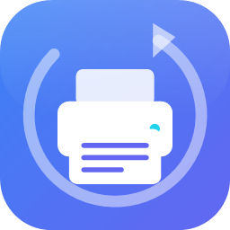
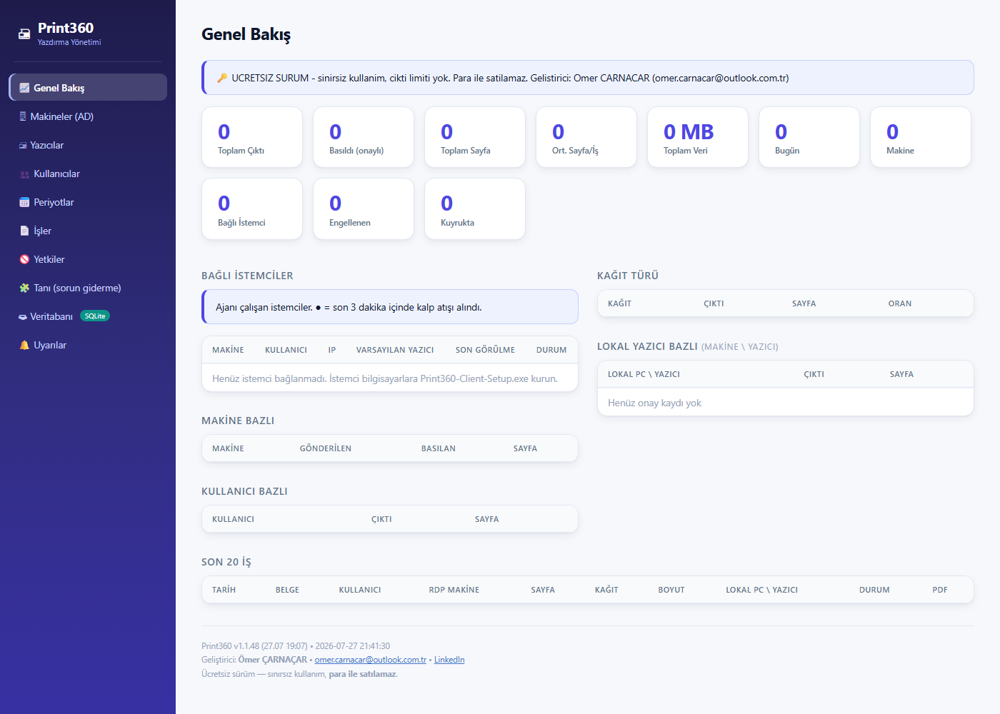
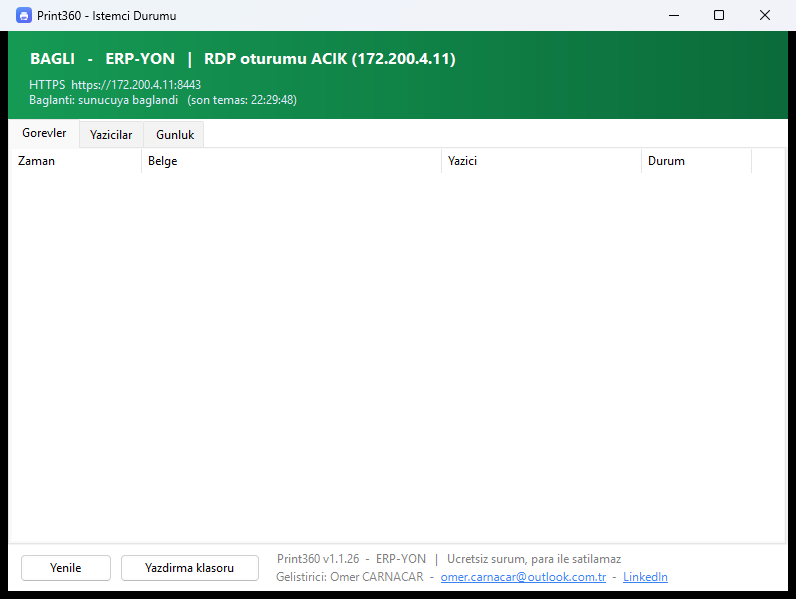
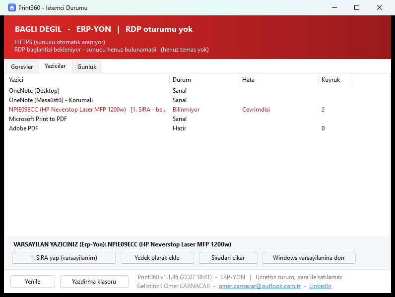
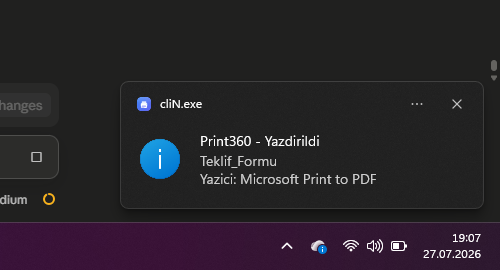

<div align="center">



# Print360

**RDP / Terminal Server oturumlarından yerel yazıcılara sorunsuz yazdırma**
_Sürücü uyumsuzluğu yok · Merkezi raporlama · Kurulumu tek tıkla_

[](https://github.com/OmerCarnacar/print360/actions/workflows/build.yml)
[](https://github.com/OmerCarnacar/print360/releases/latest)
[](https://github.com/OmerCarnacar/print360/releases)
[-059669)](LICENSE)

[](#gereksinimler)
[](#gereksinimler)
[](#neden-print360)
[](https://github.com/OmerCarnacar/print360/stargazers)

</div>

---

## Sorun

RDP ile bağlanan kullanıcılar kendi bilgisayarlarındaki yazıcıdan çıktı alamaz. Klasik sebepler:

- Sunucuda **yazıcı sürücüsü yok** ya da sürüm uyuşmuyor
- **Easy Print** eski/özel yazıcılarda hatalı çalışıyor veya bozuk çıktı veriyor
- Yazıcı yönlendirmesi kapalı; açılsa bile bağlantı koptuğunda işler kayboluyor
- Kim, ne kadar, hangi kâğıda bastı — **hiçbir kayıt yok**

## Çözüm

Print360, çıktıyı sunucuda **PDF'e** çevirir ve RDP oturumu üzerinden kullanıcının kendi bilgisayarına taşır; baskı orada, kullanıcının **kendi yazıcısıyla** yapılır.

```
┌── RDP SUNUCUSU ────────────────┐        ┌── KULLANICININ BİLGİSAYARI ──┐
│                                │        │                              │
│  Ctrl+P → "Print360 - ali"     │        │  Print360 istemcisi          │
│         ↓                      │        │         ↓                    │
│  PDF olarak yakalanır          │        │  Kendi yazıcısına basar      │
│         ↓                      │        │         ↓                    │
│  Sıkıştırılır ────── RDP / HTTPS ──────► │  "Yazdırıldı" bildirimi      │
│         ↓                      │        │         ↓                    │
│  Panel: kim/ne/kaç sayfa  ◄────────────── onay + sayaç                 │
└────────────────────────────────┘        └──────────────────────────────┘
```

**Sunucuda tek bir gerçek yazıcı sürücüsü kurulmaz.** Yazıcı eski ya da yeni olsun fark etmez — baskıyı zaten o yazıcıyı tanıyan bilgisayar yapar.

---

## Ekran görüntüleri

### Yönetim paneli (web)


### İstemci durum penceresi
<p>


</p>

### Yazdırma bildirimi


---

## Neden Print360

| | |
|---|---|
| 🔌 **Sıfır ayar** | İstemci, açık RDP oturumundan sunucuyu kendisi bulur. IP/port yazmanız gerekmez. |
| 🗄️ **Veritabanı zorunlu değil** | MSSQL varsa kullanır; yoksa **SQLite**'a, o da yoksa CSV'ye yazar. Hiçbir kurulum gerektirmez. |
| 📦 **Harici bağımlılık yok** | Yalnızca .NET Framework 4.x. Panel saf WPF, kurulum native — PowerShell bile çalıştırmaz. |
| 🖨️ **Kişiye özel yazıcı** | Her kullanıcı kendi **öncelik sırasını** belirler: 1. yazıcı kapalıysa 2.'ye düşer. |
| 🔀 **Çoklu RDP** | Aynı anda birden fazla sunucuya bağlıysanız hepsinden iş alır. |
| 📊 **Merkezi raporlama** | Kullanıcı/makine/kâğıt/yazıcı bazlı sayaçlar, maliyet, kota, uyarılar. |
| 🧩 **Tanı sayfası** | "Yazdırdım ama gelmedi" durumunda 7 adımlık kontrol listesi sorunu adıyla söyler. |
| 🆓 **Ücretsiz** | Lisans anahtarı yok, çıktı limiti yok. |

---

## Kurulum

### Gereksinimler

| | Sunucu | İstemci |
|---|---|---|
| İşletim sistemi | Windows Server 2016 / 2019 / 2022 / 2025 | Windows 10 / 11 |
| Çalışma zamanı | .NET Framework 4.x | .NET Framework 4.x |
| Yazıcı özelliği | "Microsoft Print to PDF" _(kurulum kendisi açar)_ | — |
| Veritabanı | **isteğe bağlı** (MSSQL) | — |

### Adımlar

1. **[⬇ Son sürümü indirin](https://github.com/OmerCarnacar/print360/releases/latest)** (ZIP).
2. **Sunucuda** `Print360-Server-Setup.exe` — yönetici olarak çalıştırın.
   Sihirbaz kullanıcıları, yazdırma modunu, portları ve (isterseniz) MSSQL'i sorar.
3. **Kullanıcı bilgisayarlarında** `Print360-Client-Setup.exe`.
   Açık bir RDP oturumu varsa sunucu adresi **otomatik dolar**.
4. Sunucudaki RDP oturumunuzda `Print360 - <kullanıcı>` yazıcısına yazdırın.

> Çıktı, kullanıcının kendi bilgisayarındaki varsayılan yazıcıdan çıkar ve
> ekranın sağ altında **"Yazdırıldı"** bildirimi görünür.

### Panel

```
https://<sunucu>:8443      (veya http://<sunucu>:8360)
```
Masaüstünde **Print360 Panel** kısayolu da oluşturulur.

---

## Nasıl çalışır

| Katman | Görev |
|---|---|
| **Sanal yazıcı** | Kullanıcı başına `Print360 - <kullanıcı>`; çıktıyı doğrudan spool dosyasına yazar |
| **Sunucu ajanı** | Spool'u izler, belge adı/sayfa sayısını olay günlüğünden okur, GZip'leyip kuyruğa alır |
| **Taşıma** | 1) RDP Virtual Channel 2) HTTPS kuyruğu 3) `\\tsclient` — sırayla denenir |
| **İstemci ajanı** | İşi alır, kullanıcının öncelik sırasına göre yazıcıya basar, onay döner |
| **Panel** | Web (HttpListener) + masaüstü (WPF); MSSQL / SQLite / CSV üzerinde çalışır |

Ayrıntılar: [docs/VIRTUALCHANNEL.md](docs/VIRTUALCHANNEL.md)

---

## Kaynaktan derleme

```powershell
# Gereken: .NET Framework 4.x SDK (csc.exe) + Inno Setup 6
powershell -ExecutionPolicy Bypass -File build.ps1 -Version 1.1
```

Üretilenler:
- `dist/Print360-Server-Setup.exe`
- `dist/Print360-Client-Setup.exe`
- `Print360-Kurulum-v<sürüm>-<ggAA-ssdd>.zip`

RDP Virtual Channel eklentisini yeniden derlemek için (MSVC + Windows SDK):
```cmd
cd vc && build-vc.cmd
powershell -File test-protokol.ps1      :: protokol testi (kanal gerekmez)
```

---

## Sorun giderme

Panelde **Tanı** sayfası (`/tani`) şunları adım adım gösterir:

1. Yazıcı sürücüsü kurulu mu
2. Print360 yazıcıları oluşmuş mu (+ port yolları)
3. Sunucu ajanı çalışıyor mu
4. Oturumun RDP istemci adı belirlenebiliyor mu
5. Spool'da bekleyen iş var mı
6. Gönderim kuyruğu
7. Ajan ve kurulum günlüklerinin son satırları

Günlükler: `C:\Print360\logs\`

---

## SSS

<details>
<summary><b>MSSQL kurmak zorunda mıyım?</b></summary><br>
Hayır. Kurulumda atlayabilirsiniz; sistem SQLite'a yazar (kurulum gerektirmez).
İsterseniz sonradan panelden <b>Veritabanı</b> sayfasından MSSQL'e geçebilirsiniz.
</details>

<details>
<summary><b>Kullanıcının birden fazla yazıcısı varsa hangisine basar?</b></summary><br>
Kullanıcının kendi belirlediği <b>öncelik sırasına</b> göre. İlk yazıcı kapalı/hatalıysa
otomatik olarak yedeğe düşer. Hiç seçim yapılmamışsa Windows varsayılan yazıcısı kullanılır.
Rastgele bir yazıcıya <b>asla</b> gönderilmez.
</details>

<details>
<summary><b>İstemci sunucuyu nasıl buluyor?</b></summary><br>
Açık RDP bağlantılarını (TCP 3389) tespit edip her birinde Print360 arar.
Aynı anda birden fazla sunucuya bağlıysanız hepsinden iş alır.
İsterseniz elle de yazabilirsiniz: <code>Server=SRV01,SRV02</code>
</details>

<details>
<summary><b>Çıktılar sunucuda saklanıyor mu?</b></summary><br>
Evet, <code>C:\Print360\archive</code> altında 90 gün (GZip'li). Panelden indirilebilir.
Süre dolunca otomatik temizlenir.
</details>

---

## Dosya doğrulama ve güvenlik

Kurulum dosyalarının yolda değiştirilmediğini **SHA-256** özetiyle
doğrulayabilirsiniz. Değerler: **[SHA256SUMS.txt](SHA256SUMS.txt)**

```powershell
Get-FileHash .\Print360-Kurulum-v1.1.54-2807-1708.zip -Algorithm SHA256
```

Aynı özet değerini VirusTotal arama kutusuna yapıştırarak dosyanın taramasını
görebilirsiniz — dosyayı yüklemenize gerek yoktur.

> ⚠️ **Kurulum dosyaları kod imzalı değildir.** Kod imzalama sertifikası ücretli
> olduğu ve proje ücretsiz dağıtıldığı için imzalanmamıştır. Bu nedenle Windows
> SmartScreen uyarı gösterir; imzasız dosyalar bazı tarayıcılarda sezgisel analiz
> sonucu **yanlış pozitif** üretebilir. Şüphe duyarsanız kaynak kod bu depoda
> açıktır ve paketi kendiniz derleyebilirsiniz.

Yazılım **dışarıya hiçbir veri göndermez** ve internet bağlantısı gerektirmez.
Tüm iletişim, yerel ağınızdaki sunucu ile istemciler arasında gerçekleşir.

---

## Katkı

Katkılara açığım — hata bildirimi, öneri, kod ya da sadece farklı bir ortamda
deneyip sonucu paylaşmanız bile değerli.

> ⚠️ **`main` dalı korumalıdır ve yalnızca depo sahibi tarafından yönetilir.**
> Doğrudan gönderim yapılamaz. Katkı için depoyu **çatallayın (fork)**, kendi
> dalınızda çalışın ve buraya bir **pull request** açın.

Adım adım anlatım: [CONTRIBUTING.md](CONTRIBUTING.md)

---

## Lisans ve sorumluluk reddi

**Lisans türü:** Kaynağı açık, ücretsiz, **tescilli (proprietary)** lisans.

> ⚠️ Bu bir **açık kaynak lisansı değildir.** Kaynak kodu herkese açıktır ve
> incelenebilir; ancak satış yasağı içerdiği için OSI'nin açık kaynak tanımını
> karşılamaz. MIT / GPL / Apache **değildir**.

| | |
|---|---|
| ✅ Serbest | Kişisel, kurumsal ve ticari ortamlarda **ücretsiz** kullanmak; bedelsiz kopyalayıp dağıtmak; kaynağı inceleyip kendi ihtiyacınıza göre değiştirmek |
| ❌ Yasak | **Para karşılığı satmak**, kiralamak, abonelikle sunmak, ücretli bir ürünün parçası olarak vermek, geliştirici bilgisini kaldırmak |

### Sorumluluk reddi

Bu yazılım **hiçbir bedel alınmadan**, **"olduğu gibi"** sunulmaktadır.
**Geliştirici hiçbir sorumluluk üstlenmez** ve hiçbir garanti vermez.

Yazılımın kullanılmasından, kullanılamamasından veya hatalı çalışmasından doğabilecek
**hiçbir zarardan** — veri/belge kaybı, çıktının yanlış yazıcıya gitmesi, iş kesintisi,
kâr kaybı, sarf malzemesi maliyeti ve benzerleri dahil — geliştirici sorumlu tutulamaz.
Destek, bakım veya güncelleme sağlama yükümlülüğü de yoktur.

**Kullanmadan önce:** üretim ortamına almadan mutlaka kendi ortamınızda test edin ve
kurulum öncesi sistem yedeği alın. Yazılım yazıcı, kayıt defteri ve zamanlanmış görev
ayarlarını değiştirir.

**Kişisel veriler:** Print360 kullanıcı adı, bilgisayar adı, belge adı ve sayfa sayısı
kaydeder. KVKK/GDPR kapsamında **veri sorumlusu yazılımı kuran kurumdur**, geliştirici
değildir. Yazılım dışarıya hiçbir veri göndermez.

Tam metin: **[LICENSE](LICENSE)**

---

<div align="center">

**Ömer ÇARNAÇAR** — Geliştirici

[omer.carnacar@outlook.com.tr](mailto:omer.carnacar@outlook.com.tr) · [LinkedIn](https://www.linkedin.com/in/omercarnacar/)

<sub>Faydalı bulduysanız ⭐ vermeyi unutmayın.</sub>

</div>
